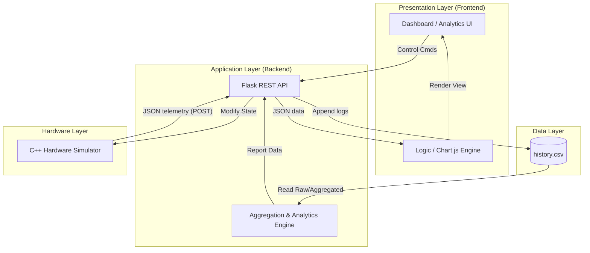
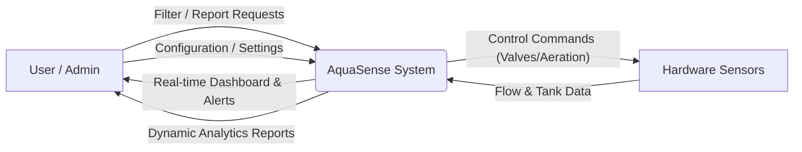
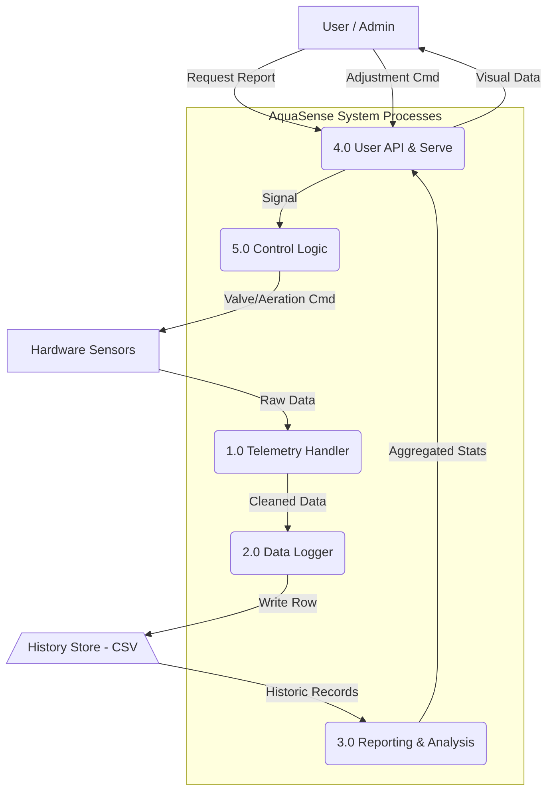
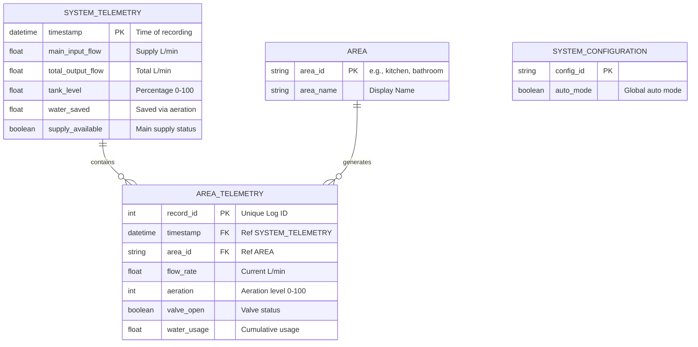

# AquaSense System Architecture & Design

This document details the software architecture and data flow of the AquaSense Water Management System.

## 1. System Architecture

The project follows a **Modified Client-Server Architecture** with three distinct layers:

---

## 2. Data Flow Diagrams (DFD)

### Level 0: Context Diagram
The Context Diagram shows the system as a single process and its relationship with external entities. (Following standard DFD notation: Squares for External Entities, Rounded/Circles for Processes).

---

### Level 1: Functional Decomposition
Level 1 breaks the system into its primary functional processes.

---

## 3. Data Dictionary (Key Entities)

| Data Element | Source | Description |
| :--- | :--- | :--- |
| **InputFlow** | Sensors | Main municipal water supply rate (L/m). |
| **OutputFlow** | Sensors | Total summary of water leaving the tank (Sum of all areas). |
| **AreaFlows** | Sensors | Individual telemetry for Kitchen, Bathroom, and Garden. |
| **TankLevel** | Sensors | Current percentage of tank capacity. |
| **WaterSaved** | System | Calculated volume of water recovered via aeration mapping. |
| **Granularity** | User | Selection parameter (Hourly/Daily/Weekly/Monthly) for P3. |

---

## 4. Hardware-Software Interface
The system communicates via **HTTP/REST**. The Hardware tier (C++) acts as a producer, pushing data to the API at a frequency of 0.5Hz (every 2 seconds). The Presentation tier (Web) acts as a consumer, polling or requesting aggregated insights on-demand.

---

## 5. Entity-Relationship (ER) Diagram
This diagram represents the normalized relational database structure of the AquaSense system telemetry and configuration. It uses standard Crow's Foot notation.

