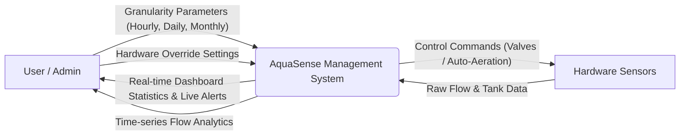
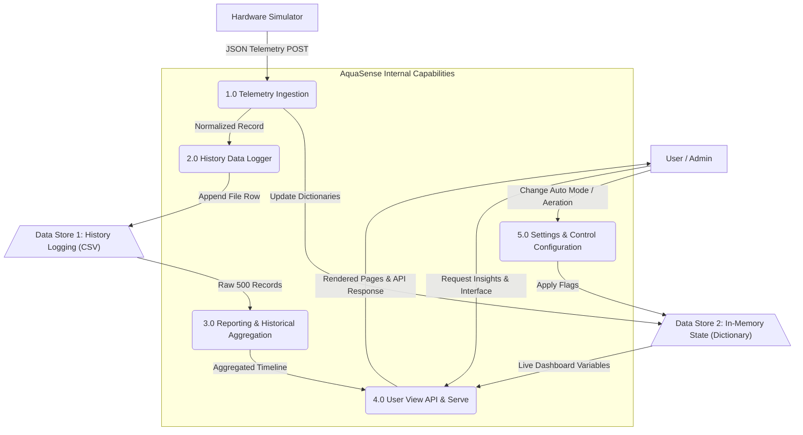
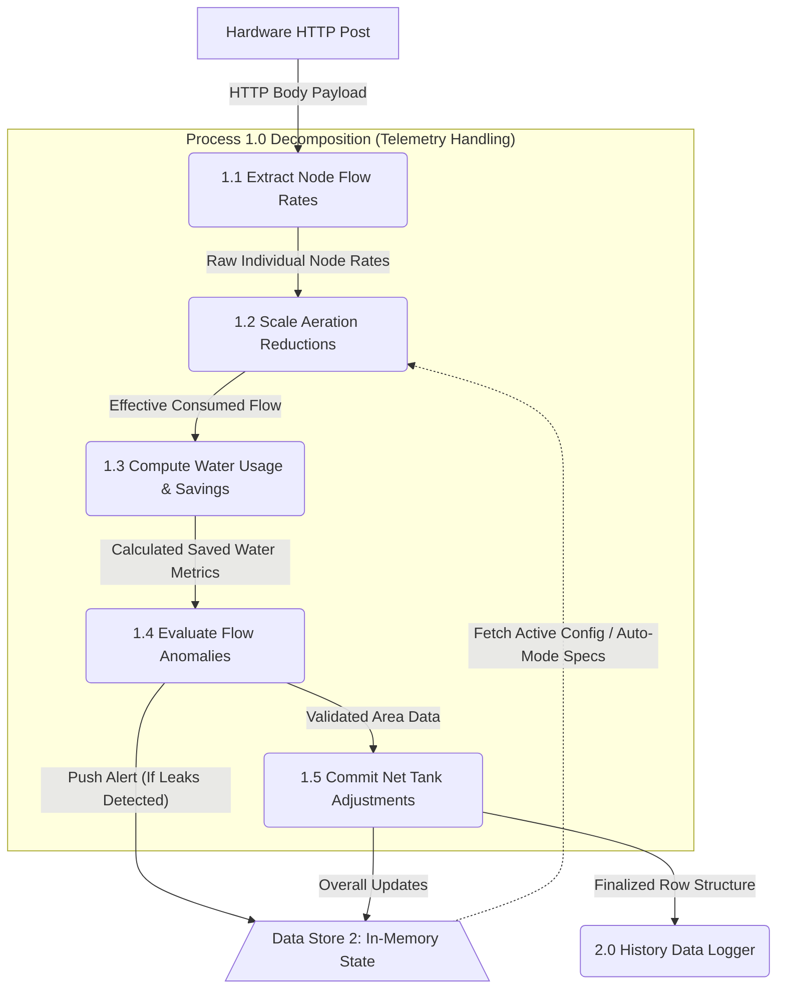

# AquaSense Data Flow Diagrams (DFD)

Data flow diagrams show how data moves through an information system. 

## Level 0 (Context Diagram)
The Context Diagram shows the system as a single black-box process and its relationship with external entities (Users and Hardware).

## Level 1 (Functional Decomposition)
Level 1 breaks the system down into its primary subsystems (processes), exposing the major internal data stores (like the CSV History).

## Level 2 (Sub-Process Decomposition)
Level 2 breaks a major Level 1 process into its detailed, step-by-step data transformations. Here is the Level 2 DFD for **Process 1.0 (Telemetry Ingestion)**, detailing how the Python backend computes saved water and handles constraints:

