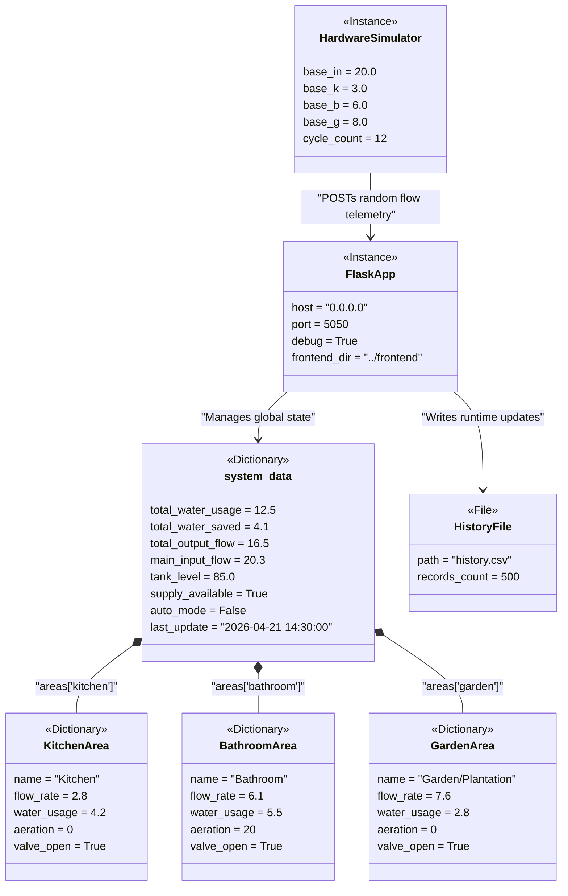

# AquaSense Object Diagram

The following Object Diagram illustrates a snapshot of the AquaSense mockup at runtime. It shows the active software components, their internal state (values), and their references to one another.

## Key Aspects of the Object Graph
1. **`HardwareSimulator` (C++)**: Connects to the Flask backend to push runtime simulation telemetry (like random changes to `base_k` and `base_b` flows).
2. **`FlaskApp`**: Manages the HTTP server config and maintains a reference to the global `system_data` dictionary.
3. **`system_data`**: Acts as the central in-memory store for the application's real-time state, referencing individual area dictionary objects.
4. **`HistoryFile`**: The backend appends a subset of properties from `system_data` to this CSV object iteratively.
